# Portfolio website

[Published portfolio website link](https://naughty-swartz-e6e6cb.netlify.app/)

[GitHub repo link](https://github.com/RVArtist/portfolio.git)

## Description of portfolio website

### Purpose

Portfolio website ia my portfolio which includes the below pages.

1. Home
    - It includes sections for introduction, skills, projects list, Academics and blogs preview and links.
2. Contact me
    - Contact form with First name, Last name, Country, Subject, email and Submit button
3. Blogs
    - 5 dummy placeholder blogs with pictures
    - Popular blog posts
    - Follow me link
4. About me
    - My likes
    - My dislikes
    - My strengths
    - My weaknesses
    - My soft skills
    - My work in progress

5. Projects
    - Personal portfolio website
    - e-commerce website
    - Another 6 dummy placeholder projects

### Functionality/Features

- Responsive
- Flexbox
- Grid
- code reuse @mixin, @extend
- Divs
- Semantic HTML tags
- Basic animation
- Saas
- Links
- Typography
- SRI

### Sitemap

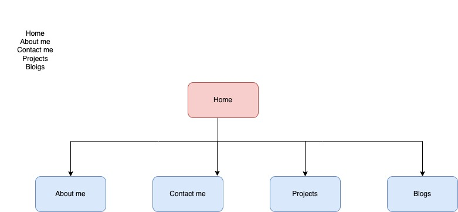

### Screenshots

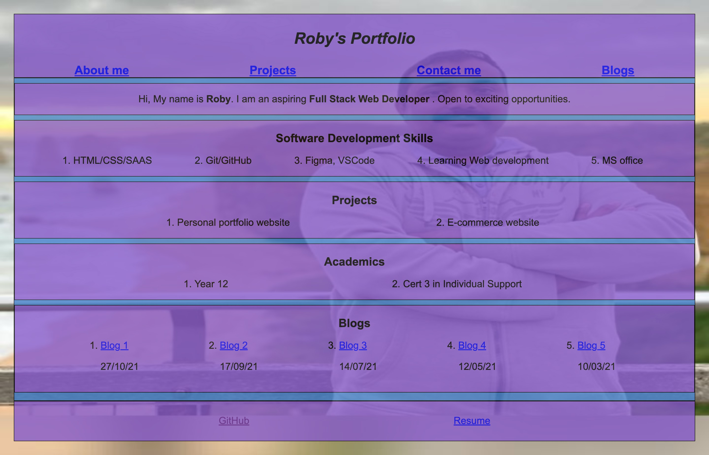

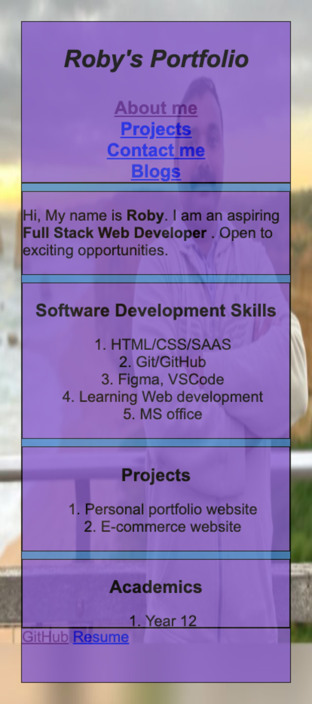
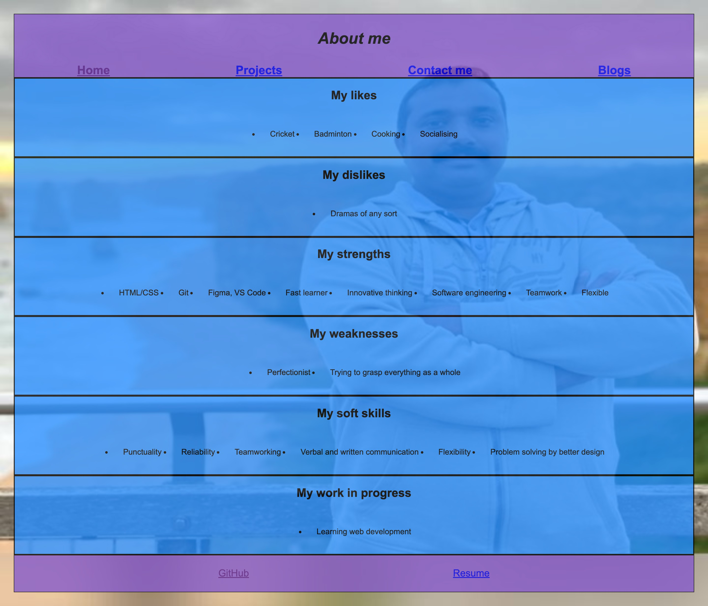
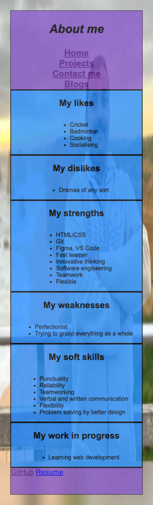
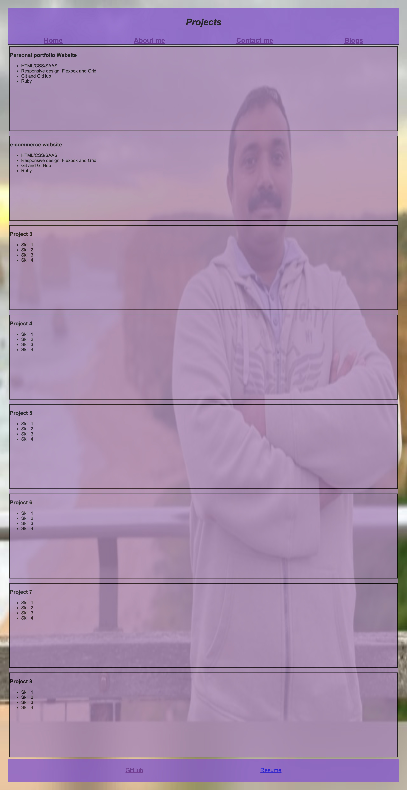
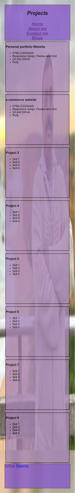
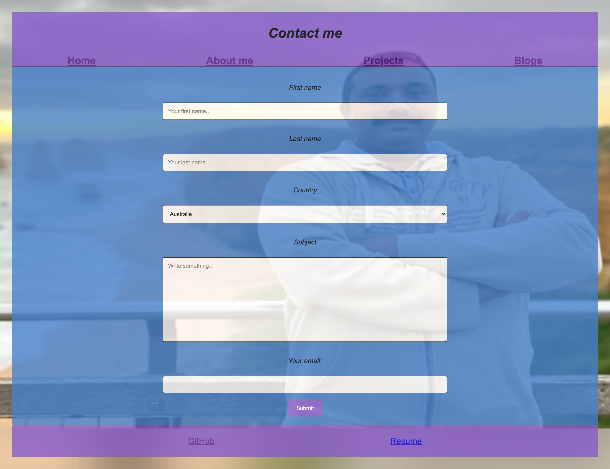
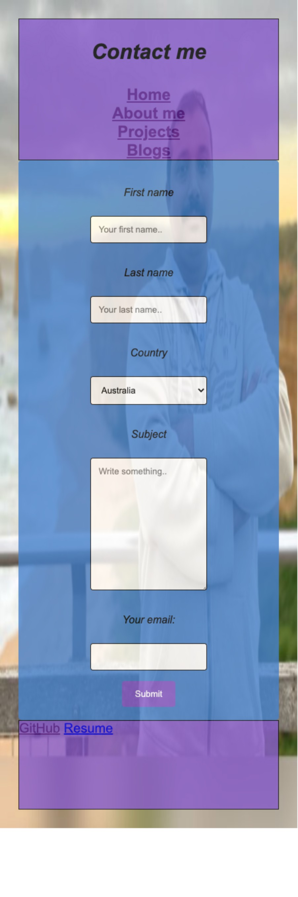
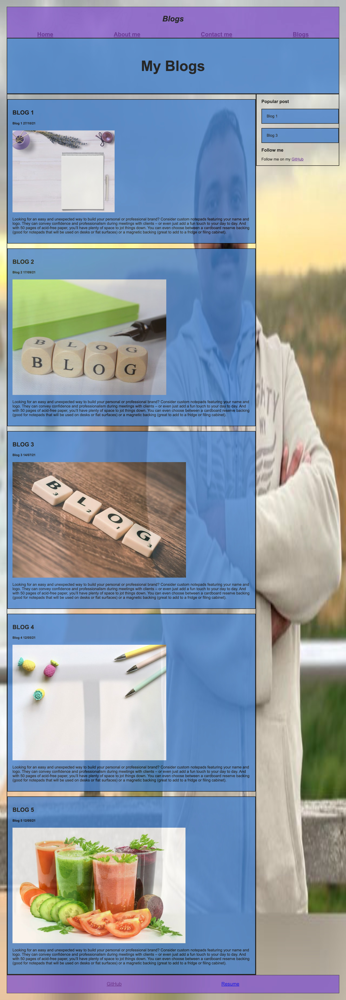
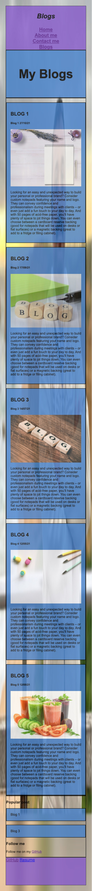

### Target Audience

- Potential future employers
- Potential future customers

- Recruiters

### Tech stack

- HTML/CSS
- SaaS
- Git/GitHub
- Formspree
- Figma
- Drawio
- Netlify
